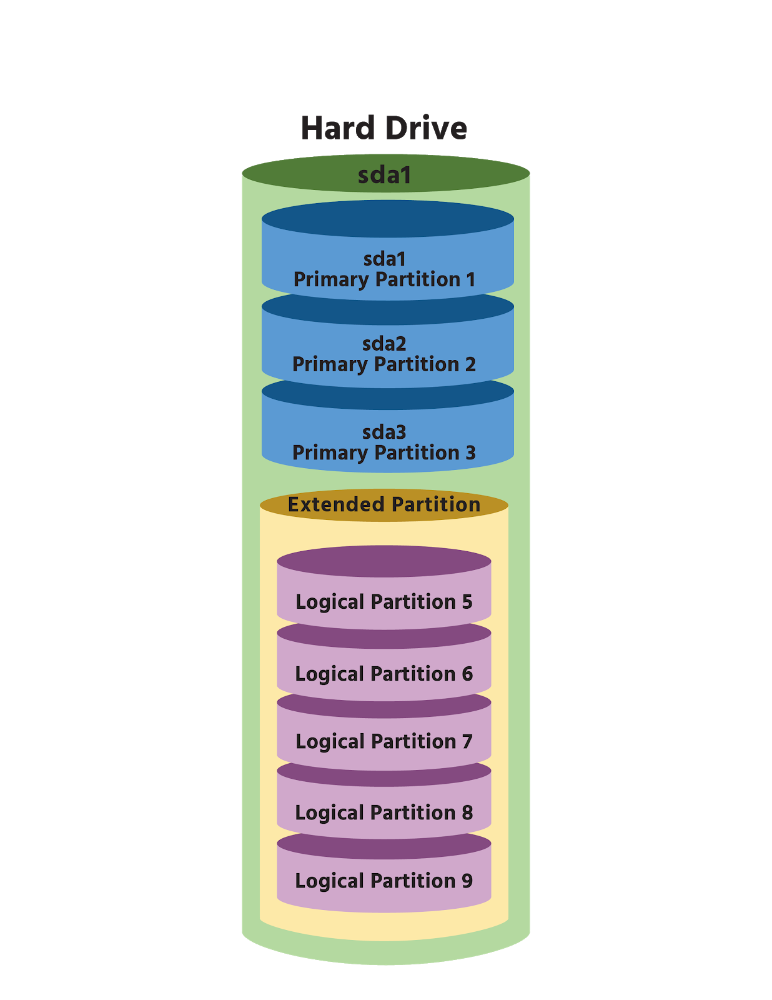
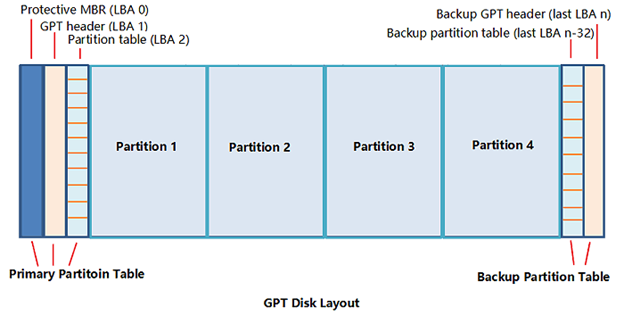

# Particions de disc

## Introducció

Actualment, els discos tenen molta capacitat d'emmagatzematge. Això permet que es puguin fer subdivisions, i al mateix temps instal·lar-hi diferents sistemes de fitxers segons les necessitats.

### **Perquè crear particions?**

1. Per poder instal·lar més d'un sistema operatiu \(_Dual boot systems_\).
2. Per separar les dades del sistema de les dades dels usuaris. Els sistemes operatius inclouen **programes per gestionar les particions** amb les opcions més importants:
3. Crear el sistema de particionat.
4. Crear i esborrar particions.
5. Redimensionar.
6. Formatar...

Però també es poden trobar altres programes, fins i tot gratuïts, amb altres funcions que els primers no tenen:

1. Moure particions.
2. Clonar.

> Els sistemes més habituals per gestionar les particions són **MBR** i **GPT**.

## Particionat MBR

* Tota la informació sobre les particions es troba al final del primer sector del disc \(**MBR**\).
* Només es poden crear **4 particions primàries**.
* La mida màxima d'aquestes particions primàries és de **2 TiB**.

  Una de les particions primàries es pot marcar com a **partició activa**. Si hi ha diversos sistemes operatius, arrencarà el que es trobi en aquesta partició.

Per superar la **limitació de 4 particions** és possible fer que una d'aquestes 4 sigui una partició estesa.

La **partició estesa \(**_**extended partition**_**\)** serveix per contenir **particions lògiques**, tantes com es vulgui.

## Particionat GPT

* Manté el sector **MBR per compatibilitat** però no l'utilitza.
* La informació es troba en els 33 sectors següents al MBR.
  * Aquesta informació està duplicada en els 33 últims sectors del disc.
  * En el primer sector \(l'últim en la 2ª GPT\) hi ha l'encapçalament de GPT.
  * En els altres 32 sectors hi ha la informació de les fins a 128 particions.
* Totes les particions són primàries \(**no hi ha particions esteses ni lògiques**\).

En l'**espai lliure** encara es poden crear moltes particions més.

